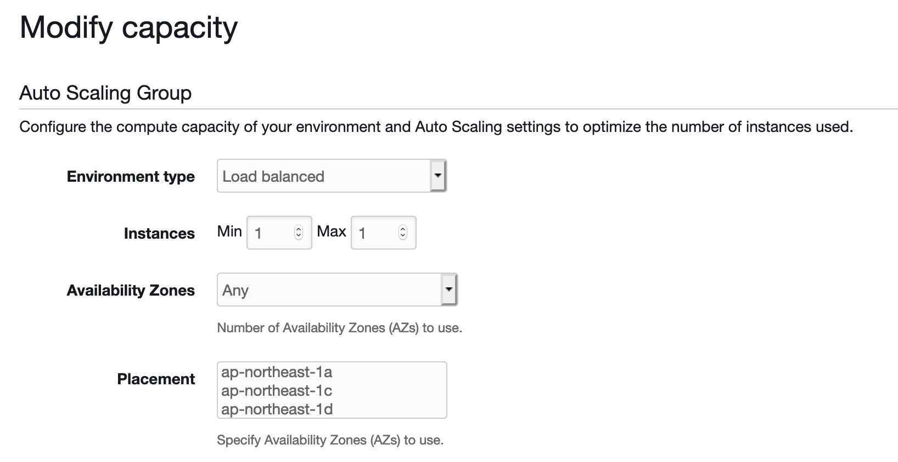

# Setting up the Elastic Beanstalk Load Balancer

## Create New Application    

## Select Web Server Environment

## Configure Web Server Environment

### Configure More Options

## Capacity

### Modify Capacity

## Load Balancer

## Add Listener

