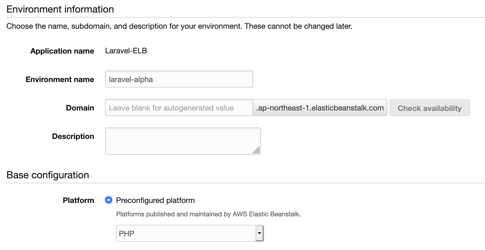

# Elastic Beanstalk with HTTPS Quick Start Guide

* AWS Elastic Beanstalk
  * [Request a Certificate](https://console.aws.amazon.com/acm/)
  * Create New Application
  * Create Environment
    * Select environment tier
      * Web server environment
    * Create a web server environment
      * Environment name
      * Platform
        * Preconfigured platform - PHP
      * Configure More Options
    * Modify Capacity
      * Environment type: Load Balanced
      * Save
    * Modify Load Balancer
      * Application Load Balancer
        * Add Listener
        * port 443, https, select certificate

## Create New Application    


## Select Web Server Environment


## Configure Web Server Environment




### Configure More Options


 

## Capacity


### Modify Capacity


    * 
   
    1. ELB optional 12
    1. ELB LB
    1. done
1. Laravel Project
    1. poing/laravel-elb
    1. artisan elb:install
1. Version Control
    1. git init
    1. git add
    1. git commit
1. AWS CLI
    1. eb init
    1. 


---
---


### Starting from Scratch

```sh
composer create-project --prefer-dist laravel/laravel my-project
cd my-project
composer require poing/laravel-elb
php artisan elb:install
php artisan elb:publish; # optional

git init
git add .
git commit -am "Initial Commit"

eb init
eb use elb-environment
eb setenv APP_KEY= APP_NAME= DB_HOST= DB_DATABASE= DB_USERNAME= DB_PASSWORD=
eb deploy
```

`psr-4` autoload *-and-* automatic registration of the `ServiceProvider` handles loading the middleware *automatically*.  

*No additional steps are necessary.  **Except** on the [Elastic Beanstalk Load Balancer](http://docs.aws.amazon.com/elasticbeanstalk/latest/dg/configuring-https-elb.html) side.* 

---


## Installation
You can install this package using [Composer](https://getcomposer.org/)
```
composer require poing/laravel-elb
```

`psr-4` autoload *-and-* automatic registration of the `ServiceProvider` handle loading the middleware *automatically*.  

*No additional steps are necessary.  **Except** on the [Elastic Beanstalk Load Balancer](http://docs.aws.amazon.com/elasticbeanstalk/latest/dg/configuring-https-elb.html) side.* 

## Usage

`HTTPS` redirection will be *disabled* when the Laravel `APP_ENV` is set to `local`.

```
APP_ENV=local  // HTTPS Redirection Disabled
```

## Configuration

## .ebextensions

**YOU MUST USE GIT FOR `eb deply` TO WORK PROPERLY!**